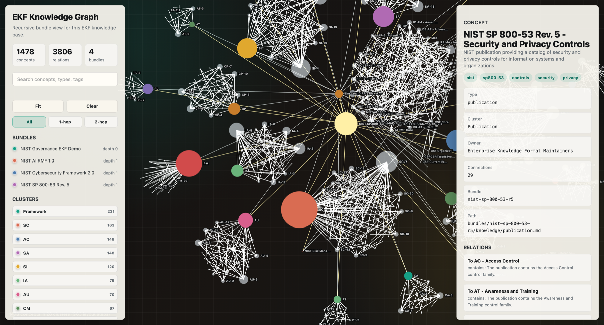

# Enterprise Knowledge Format

## Why EKF Exists

Enterprise knowledge bases often fail in two opposite ways:

- They are too loose to trust: documents, wikis, PDFs, repos, exports, and diagrams drift apart.
- They are too rigid to maintain: catalogs, graph databases, and search systems become required before basic discovery works.

EKF takes a middle path:

- **Progressive discovery first** - Every index, concept, source, artifact, and relation should have a short description that helps a human or agent decide whether to go deeper.
- **Markdown is canonical** - Curated concepts live in markdown with YAML frontmatter, so the base remains portable, reviewable, and grep-friendly.
- **Graph in frontmatter** - Typed relationships live in `related`, so graph traversal does not require prose parsing.
- **Source and artifacts stay separate** - Raw material belongs in `source/`; generated views belong in `artifacts/`; curated knowledge belongs in `knowledge/`.
- **Nested bundles model ownership** - Independently owned domains, systems, platforms, and governance areas can live under `bundles/`.
- **Governance without lock-in** - EKF requires ownership, status, timestamps, provenance, and lifecycle metadata without requiring a specific cloud, database, catalog, model, or serving layer.

## Repository Map

- [SPEC.md](SPEC.md) - The EKF v0.1 draft specification.
- [skills/ekf-bootstrap](skills/ekf-bootstrap/SKILL.md) - Installable bootstrap skill for creating, validating, parsing, and visualizing EKF bundles.
- [examples/nist-ekf](examples/nist-ekf/) - Lightweight pointer to the companion NIST EKF demo repository.
- [AGENTS.md](AGENTS.md) - Maintenance guidance for future agents working on this standard.

## Quick Start

Install the bootstrap skill with `npx skills`:

```sh
npx skills add Enterprise-knowledge/enterprise-knowledge-format --skill ekf-bootstrap
```

For a global Codex install:

```sh
npx skills add Enterprise-knowledge/enterprise-knowledge-format --skill ekf-bootstrap -g -a codex
```

Or ask your coding agent:

```text
Install the `ekf-bootstrap` skill from `Enterprise-knowledge/enterprise-knowledge-format` with `npx skills`, then use it to create an Enterprise Knowledge Format repository.
```

The installed skill includes its own copy of the EKF specification in `references/SPEC.md`, so it can scaffold and expand EKF repositories without depending on this repository being checked out locally.

## Try It

Create a starter EKF bundle:

```text
Use $ekf-bootstrap to create a new EKF repository in `./enterprise-knowledge` titled "Acme Enterprise Knowledge Base", owned by "Enterprise Architecture". Create nested bundles for `customer-platform`, `billing-platform`, and `data-platform`.
```

Grow it from source material:

```text
Use $ekf-bootstrap to inspect the source material I added under `source/` and `bundles/*/source/`. Add or update `ekf-source.yml` manifests, then draft initial EKF concepts under `knowledge/` with descriptions, provenance in `sources`, and typed relationships in `related`.
```

Generate a graph view:

```text
Use $ekf-bootstrap to validate this EKF bundle, parse its `related` frontmatter into graph JSON, and create a browser-readable graph artifact under `artifacts/html/knowledge-graph/`.
```

## What an EKF Concept Looks Like

```yaml
---
type: service
title: Customer Identity Service
description: Service that resolves customer identity for account, billing, and support workflows.
status: active
owner:
  name: Customer Platform Team
updated: 2026-06-23T00:00:00Z
sources:
  - path: /source/repositories/customer-platform/openapi.yml
    description: API contract used as source evidence for service behavior.
related:
  - name: Billing Account Model
    path: /bundles/billing-platform/knowledge/data/billing-account.md
    relation: supports
    description: Customer identity links billing accounts to customer records.
tags:
  - customer-platform
  - identity
---
```

## Companion Demo

The [NIST EKF demo](https://github.com/Enterprise-knowledge/nist-ekf) shows EKF applied to public governance material:



- NIST Cybersecurity Framework 2.0
- NIST AI Risk Management Framework 1.0
- NIST SP 800-53 Rev. 5

It demonstrates 1,478 concepts, 3,806 typed relationships, nested bundles, generated markdown artifacts, source provenance, graph parsing, and a static HTML graph view.

## Validation

The bootstrap skill includes helper scripts for local validation and graph generation:

```sh
uv run --with pyyaml python skills/ekf-bootstrap/scripts/validate_ekf.py <bundle>
uv run --with pyyaml python skills/ekf-bootstrap/scripts/parse_ekf_graph.py <bundle> \
  --output <bundle>/artifacts/graph/graph.json
```

This repository also includes a CI workflow that smoke-tests the bootstrap, validation, and graph parser path.

## Status

EKF is currently **v0.1 draft**. The standard is ready for early feedback, trial implementations, and example bundles, but the schema and conformance language may still change before a stable v1.0.

## Contributing

Contributions are welcome, especially:

- feedback on the specification and conformance rules,
- small example bundles,
- validator improvements,
- graph parsing and artifact improvements,
- writeups from real-world trials.

See [CONTRIBUTING.md](CONTRIBUTING.md) before opening issues or pull requests.

## License

EKF is licensed under the [Apache License 2.0](LICENSE). Apache 2.0 is a good fit for this repository because it covers both the written standard and the bootstrap tooling, supports broad commercial and internal enterprise use, and includes an explicit patent grant.
